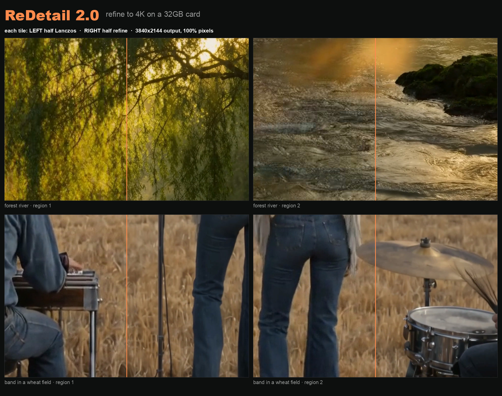
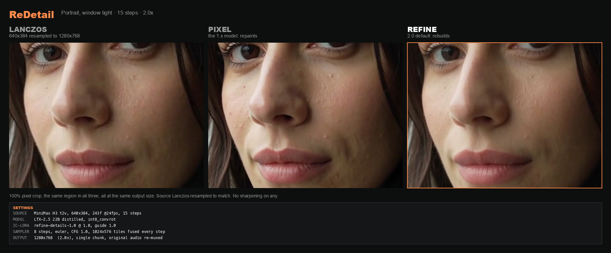

# ReDetail

Video upscaling and re-detailing for ComfyUI on LTX-2.5: two drag-and-drop workflows, and a CLI
that drives them for real clips. The default mode, **refine**, rebuilds the fine detail a soft
clip is missing and keeps the framing, colour, motion and faces as they were. 4K fits on a 32GB
card; system RAM is the limit there (see [Memory](#memory)).

[](docs/cover_4k.jpg)

Two generated clips (1376x768 and 1664x928), 97 frames each, refined to 3840x2144 in a single
14-minute pass on an RTX 5090. Every tile is a 100% crop, Lanczos on the left half and refine on
the right. The full renders, their sources and a 1:1-pixel comparison reel are on the
[v2.0 release](https://github.com/Bambushu/redetail/releases/tag/v2.0).

## Refine or pixel

Both modes run a Lightricks IC-LoRA on the LTX-2.5 22B distilled transformer.
[Refine-Details](https://huggingface.co/Lightricks/LTX-2.5-22b-IC-LoRA-Refine-Details) works in
1024x576 tiles fused at every denoising step, so VRAM follows the tile instead of the frame. The
[Pixel Spatial Upscaler](https://huggingface.co/Lightricks/LTX-2.5-22b-IC-LoRA-Pixel-Spatial-Upscaler)
re-renders the whole clip and invents the fine detail as it goes: more detail, and faces drift.

| | **refine** (default) | **pixel** |
|---|---|---|
| detail added vs Lanczos | 1.4-2.4x | 2.3-3.8x |
| fidelity to the source | **31.8-38.9 dB, SSIM 0.92-0.98** | 24.2-31.3 dB, SSIM 0.73-0.91 |
| flicker vs Lanczos | **1.4-2.7x** | 2.2-5.1x |
| 97 frames, 768x1376 to 1216x2112, 32GB card | 526 s, 28.2 GB VRAM | **206 s**, 31.9 GB VRAM |
| 4K | **one pass: 97 frames to 2176x3904, 14 min, 28.4 GB VRAM** | VRAM grows with frames x pixels |
| workflow | `ReDetail_LTX25_refine.json` | `ReDetail_LTX25_upscale.json` |

The first three rows are ranges over seven MiniMax H3 clips (640x384, 10 s, upscaled 2x).
Fidelity compares the result, scaled back down, with the source. Refine was closer to the source
and flickered less on all seven. The time and VRAM rows are single runs, on a 32GB RTX PRO 4500
and an RTX 5090.



Use **refine** to preserve faces, products or framing, and for anything going to 4K. Use
**pixel** for the most detail on soft AI footage with nothing to preserve; it renders in less
than half the time.

**What the workflows change from Lightricks' examples.** Refine pins the tile to the 1024x576
the LoRA was trained on; the example sizes tiles from your source, and a 768x1376 clip became one
tile 1.8x the trained area. Pixel's output size is settable; Lightricks' example links the canvas to the
source size, so it renders 1:1 whatever you enter. Both workflows disconnect the prompt-enhancer
branches, because ComfyUI validates those branches even when they are switched off and a single
missing file blocks the whole queue. Both Missing Models panels point at the int8 files. `LICENSE` lists
every edit.

## Quick start

**The workflow.** Drop `workflows/ReDetail_LTX25_refine.json` into ComfyUI and read the note
marked **START HERE**. The Missing Models panel links every file it needs. Load your clip, pick
`output_size` on the **Preprocess** group (FullHD or 4K), and queue.

Before loading a clip into the workflow, make sure it has an audio track and a frame count of
8n+1:

```bash
# add a silent audio track (most AI clips have none)
ffmpeg -i in.mp4 -f lavfi -i anullsrc=r=48000:cl=stereo -shortest \
       -map 0:v:0 -map 1:a:0 -c:v copy -c:a aac ok.mp4

# count the frames, then trim to 8n+1 or the model drops the tail
ffprobe -v error -count_frames -select_streams v:0 \
        -show_entries stream=nb_read_frames -of csv=p=0 ok.mp4
ffmpeg -i ok.mp4 -frames:v 97 -c:a copy trimmed.mp4      # 97 = 8*12+1, about 4 s at 24 fps
```

**The CLI.** `redetail.py` drives the same graphs over ComfyUI's HTTP API and does that prep
itself:

```bash
python3 redetail.py --setup                              # checks the install, names what is missing
python3 redetail.py clip.mp4 --scale 1.5                 # refine
python3 redetail.py clip.mp4 --scale 1.5 --model pixel   # pixel
```

The CLI calculates the output size for your chosen scale instead of using two presets, adds a
silent audio track where needed, keeps each chunk at 8n+1 frames, adds refine's 8-frame tail pad,
splits long clips at their scene cuts and restores your original audio. Use it for anything longer than one short pass.

## Install

You need Python 3, `ffmpeg` and `ffprobe` on PATH, and ComfyUI with
[ComfyUI-LTXVideo](https://github.com/Lightricks/ComfyUI-LTXVideo). Refine needs the pack from
**24 September 2026 or later**, the first with `LTXVTiledFusionSampler`.

Install the pack's `requirements.txt` and `comfy-kitchen>=0.2.26` into ComfyUI's own Python
environment, then restart ComfyUI:

```bash
/path/to/ComfyUI/venv/bin/python -m pip install "comfy-kitchen>=0.2.26"
```

```powershell
.\python_embeded\python.exe -m pip install "comfy-kitchen>=0.2.26"
```

If you install them into a different Python environment, both can import fine in a shell while
ComfyUI still reports the nodes missing. `No module named 'colour'` in the boot log means the requirements went to the
wrong Python. Packs from 22 September 2026 on run with current kornia; an older pack (pixel mode
only) needs `kornia==0.7.4`.

**Models.** The Hugging Face repos are gated. Accept the licence on each repository, the
base repository included, or the downloads fail with HTTP 403.

| file | folder | size | mode |
|---|---|---|---|
| `ltx-2.5-22b-distilled-transformer-comfy-int8-convrot.safetensors` | `models/diffusion_models/` | 21.5 GB | both |
| `gemma4-12b-with-proj-ltx-2.5-comfy-int8-convrot.safetensors` | `models/text_encoders/` | 15.4 GB | both (optional, see below) |
| `ltx-2.5-video-vae-bf16.safetensors` | `models/vae/` | 1.5 GB | both |
| `ltx-2.5-audio-vae-bf16.safetensors` | `models/vae/` | 0.4 GB | both |
| `ltx-2.5-22b-ic-lora-refine-details-1.0.safetensors` | `models/loras/` | 1.3 GB | refine |
| `ltx-2.5-22b-ic-lora-pixel-spatial-upscaler-x2-1.0.safetensors` | `models/loras/` | 0.3 GB | pixel |

`int8_convrot` is not Blackwell-only: users run it on a 3090, a 4090 and a 1070. If it won't
load, check `comfy-kitchen` before your card. Version 0.2.10, which several ComfyUI images ship,
fails on every convrot checkpoint with an error that reads like unsupported weights.

**Less VRAM: GGUF.** Install [ComfyUI-GGUF](https://github.com/city96/ComfyUI-GGUF) and put the
Q4_K_M transformer from
[Abiray/LTX-2.5-Distilled-GGUF](https://huggingface.co/Abiray/LTX-2.5-Distilled-GGUF) in
`models/unet/`:

```bash
python3 redetail.py clip.mp4 --scale 1.5 --model pixel \
  --gguf LTX-2.5-Distilled-Q4_K_M.gguf \
  --encoder gemma4-12b-with-proj-ltx-2.5-bf16.safetensors \
  --clip-device cpu --budget 150 --decode-tile 256 --decode-temporal 32
```

On an RTX 4090 that sampled 8 steps in 70 s at 21.8 GB of 24.5 GB peak. Refine takes the same
flags: on an RTX 5090, Q4_K_M refine with `--cached-cond` rendered 17 frames 640x384 to 1280x768
at 48.0 dB PSNR (SSIM 0.991) against the int8 render. Refine on a 24GB card hasn't been measured.

## Sizes

**Refine** needs both output dimensions divisible by **32**. It resizes your clip to the canvas
itself, so the source can be any size, and `--scale` lands on the nearest valid size that keeps
your aspect:

| your source | 1.5x | 2x |
|---|---|---|
| 640x384 | 960x576 | 1280x768 |
| 768x1376 | **1120x2016** (1.47x) | 1536x2752 |
| 1280x720 | **1920x1088** (1.51x) | 2560x1440 |
| 1920x1080 | **2848x1600** (1.48x) | **3808x2144** (1.99x) |
| 1920x1088 | 2880x1632 | 3840x2176 |

In the workflow you pick `output_size` instead: FullHD is a 1920 long edge and 4K a 3840 one, so
a 1920x1080 source becomes 3840x2176. Lightricks calls 4K the sweet spot for a 1080p source.
Don't go to 8K in one pass. A 1024x576 tile then covers 13% of the frame, twice the scale the
LoRA trained at, and it starts inventing texture. Refine to 4K and upscale that with Lanczos.

**Pixel** needs **/64**, because its guide is half resolution and split into 2x2 latent patches.
Off-grid sizes fail with `Error while processing rearrange-reduction pattern`.

| your source | 1.5x | 2x |
|---|---|---|
| 640x384 | 960x576 | 1280x768 |
| 768x1408 | 1152x2112 | 1536x2816 |
| 1024x576 | **1472x832** (1.44x) | 2048x1152 |
| 1088x1920 | **1600x2816** (1.47x) | 2176x3840 |
| 1920x1088 | **2816x1600** (1.47x) | 3840x2176 |

The bold pixel rows have no exact 1.5x on the /64 grid: 1920x1088's would be 2880x1632, and 1632
isn't /64. Doubling any multiple of 32 gives a multiple of 64, so 2x is usually exact. The CLI also puts a
pixel-mode source on the grid, which can crop it by a few percent or resample it. Check the
`source ->` line it prints if your framing is tight.

## Memory

**Refine.** VRAM follows the tile, and the sampler streams long clips in 97-frame windows, so one
render can cover a whole shot. On an RTX 5090, 97 frames to 2176x3904 took one 14-minute pass at
**28.4 GB** of VRAM.

System RAM is what runs out. ComfyUI keeps the weights staged in RAM (about 22 GB) and holds both
the resized clip and the decoded result as float frames, about **33 MB per output
frame-megapixel**. That 4K pass peaked at **52 GB** of RAM with `--cached-cond`. With the text
encoder loaded as well, 105 frames at the same size ran a 57 GB machine out of memory. `--budget`
caps the frame-megapixels per chunk; the refine default of 500 comes to about 44 frames per chunk
at 4K. Lower it on a smaller machine, and use `--cached-cond` for anything at 4K.

**Pixel.** VRAM grows with the clip. Keep `frames × (width × height ÷ 1,000,000)` under your
card's budget. The 96 GB row is measured; the others are starting points:

| VRAM | keep under | example that fits |
|---|---|---|
| 96 GB | ~850 | 129 frames at 2816x1600 |
| 48 GB | ~350 | 129 frames at 1472x832 |
| 24 GB | ~150 | 129 frames at 960x576 |

Sampling and VAE decode hit separate memory peaks. A 4090 finished all 8 sampling steps and then
ran out in VAE decode, so if it crashes after the progress bar completes, lower `--decode-tile`
rather than the resolution. For scale, single runs of one 243-frame 768x1408 clip on an RTX PRO
6000: 1:1 took 3 min at 52 GB, 1.5x took 7 min at 65 GB, 2x took 17 min at 80.5 GB.

## Skip the text encoder

The prompts in both graphs are fixed (pixel's are empty, refine's are Lightricks' look-and-style
prompts), so the text conditioning is the same on every run. The conditioning ships precomputed
in `tools/comfyui_cond_cache/`, so you can skip the encoder download: 15.4 GB for int8, 26 GB for
bf16. Copy that folder into `ComfyUI/custom_nodes/`, restart, and add `--cached-cond`:

```bash
python3 redetail.py clip.mp4 --cached-cond --scale 1.5
```

Pixel mode on an RTX 5090, 17 frames 640x384 to 1280x768:

| | time | peak VRAM |
|---|---|---|
| with the encoder | 29.2 s | 30.4 GB of 32 |
| `--cached-cond` | **24.0 s** | **24.8 GB** |

A cache is bit-identical to the encoder that made it (PSNR inf, equal frame hashes). The shipped
refine pair came from the `int8_convrot` encoder. The pixel pair came from Q5_K_M, and a render
with it sits at 48.3 dB PSNR against the same render through the int8 encoder. To make your own,
which then take precedence:

```bash
python3 redetail.py --bootstrap-cond --encoder <your encoder>
```

The tensors are model output, so they come under the LTX-2 Community Licence rather than MIT.

## Limits

**Refine** keeps what is in the frame, flaws included.

- It can't repair a face that is malformed in the source; it rebuilds the detail of the face
  that is there. Lowering `--guide-strength` trades fidelity for texture, and in one test 0.4
  drew a different person.
- Small text and logos can come out as glyph-shaped noise.
- From Lightricks' card: archive and broadcast footage comes out cleaner but emptier, because the
  model reads codec damage as noise (they run their Restoration IC-LoRA first). Pristine camera
  raw comes out slightly softer, because it removes grain it can't rebuild.
- An upscale can't exceed its source. Out-of-focus areas gain close to nothing.

**Pixel** is a generative re-renderer, and nothing in it preserves identity. In one test it drew in
eyelashes that were a blur in the source, and also added freckles that weren't there. On a
motocross clip it re-drew the jersey graphic and the number plate: stable across frames, but not
the source's markings. Any logo, number or text gets re-imagined.

With either mode, compare a face against your source rather than judging overall sharpness.

**The CLI** has no resume, so a failure on chunk 9 of 10 re-renders all nine. It has no polling
timeout either: if ComfyUI dies mid-run, the CLI waits until you press Ctrl-C, and you run it
again. Uploads
buffer in memory. A mid-shot seam is possible when memory forces a split with no cut nearby. It
overwrites its output without asking and uses `<output>_chunks/` as scratch, deleting only the
files it made there.

## Troubleshooting

| you see | it means | do this |
|---|---|---|
| `VAEEncodeAudio: input audio is None` | the clip is silent | add a silent audio track |
| `No module named 'colour'`, LTX nodes missing | pack requirements not installed | install them into ComfyUI's Python, restart |
| `LTXVTiledFusionSampler` missing | pack too old for refine | update ComfyUI-LTXVideo (24 Sep 2026 or later) |
| `rearrange-reduction pattern` | a pixel-mode dimension isn't /64 | use the pixel size table |
| `'NoneType' has no attribute 'Params'` | comfy-kitchen too old | `>=0.2.26`, in ComfyUI's own Python |
| `cannot import name 'pad' from kornia…` | pack older than 22 Sep 2026 on kornia 0.8 | update the pack, or pin `kornia==0.7.4` |
| `Is a directory` on Load Image (pixel) | no first frame loaded | load your clip's first frame |
| node missing / `no class_type` | a pack failed to import | restart ComfyUI and read its boot log |
| OOM after the progress bar finishes | decode spike, not sampling | lower `--decode-tile` |
| pixel output came back 1:1 | the canvas link isn't severed | use the shipped workflow, not the stock example |

`python3 redetail.py --setup` catches most of these before you render, including on a remote
ComfyUI.
It needs a directly reachable endpoint without authentication, and it sends no credentials. Pass
it the same `--model`, `--gguf` and `--encoder` flags you will render with, or it checks the
wrong files.

## Every flag

```
input                 video to upscale (omit with --setup)
--setup               check the install and exit
--model     refine    'refine' (Refine-Details, default) or 'pixel' (Pixel Spatial Upscaler)
--scale     1.5       1.0 re-detail in place · 1.5 · 2.0 (1080p -> 4K-class)
--guide-strength 1.0  refine only: how hard the guide holds to your clip. Lower trades fidelity for texture
--comfy               ComfyUI URL (default http://127.0.0.1:8188)
--out                 output file (default <input>_redetail.mp4)
--budget              frame-megapixels per chunk (500 refine, 850 pixel). Lower it if you run out of memory
--audio     original  'original' re-muxes your track; 'generated' keeps the model's
--keep-chunks         keep the per-chunk intermediates
--gguf                GGUF transformer in models/unet. Lighter; try int8 first
--encoder             text encoder filename. Prefer --cached-cond and load none
--clip-device         'cpu' or 'default'; omitted leaves the workflow value alone
--decode-tile         VAEDecodeTiled tile_size; lower it for decode OOMs
--decode-temporal     VAEDecodeTiled temporal_size (default 128)
--bootstrap-cond      load the encoder once, cache both modes' prompt conditioning, exit
--cached-cond         load that cache instead of the encoder
```

## Apple Silicon

Pixel mode only, through `workflows/ReDetail_LTX25_upscale_MAC.json`: the pixel graph with the
GGUF transformer and no text encoder at all, running on the cached conditioning above. Its note
panel covers the Mac setup. Refine hasn't been tested on Apple Silicon.

On an M5, 33 frames 640x384 to 1280x768 took **4.4 min** with three models loaded (transformer
and both VAEs), at 37.4 dB PSNR against the int8 path. Per frame-megapixel that is about 6x
slower than an RTX 5090: roughly 34 min for a 10 s clip at 2x, 19 min at 1.5x. If you would
rather run a Q5_K_M encoder than the cached conditioning, it needs the gemma4 patch for
ComfyUI-GGUF that ships beside it.

**One ComfyUI core edit is required.** `comfy/ldm/lightricks/vae/na_diffusion_decoder.py` builds
RoPE inverse frequencies in float64, which MPS doesn't support, so the render samples to the end
and then dies in `VAEDecodeTiled` with `Cannot convert a MPS Tensor to float64`. The function
already returns float32, so compute it on the CPU and move the result to the device. CUDA is
unaffected.

## Tested on

ComfyUI 0.37.2 with ComfyUI-LTXVideo from 1 October 2026, kornia 0.8.3 and comfy-kitchen 0.2.37,
on an RTX 5090, October 2026. The Apple Silicon and RTX 4090 numbers are from ComfyUI 0.32.0,
August 2026.

## Licence

The MIT grant in `LICENSE` covers this project's own code only: `redetail.py`, the
`build_*_workflow.py` scripts, `tools/` and `demos/`.

The workflow files are modified derivatives of Lightricks'
`example_workflows/2.5/LTX-2.5_V2V_TiledFusion_Upscale.json` (refine) and
`example_workflows/2.5/LTX-2.5_V2V_ICLoRA_Single_Stage_Distilled.json` (pixel), distributed
exclusively under the LTX-2 Community License Agreement. The full Agreement is in
[`workflows/LICENSE-LTX-2-Community.txt`](workflows/LICENSE-LTX-2-Community.txt), and `LICENSE`
lists what was changed. Lightricks' unmodified examples aren't redistributed here; the build
scripts say where to get them.

The Agreement's use restrictions apply to you and to anyone you pass these files on to, and any
entity with more than **$10,000,000** in annual revenue needs a paid commercial licence from
[Lightricks](https://ltx.io/model/licensing) first. The weights are under the same Agreement and
the IC-LoRAs under their own repositories' terms.
